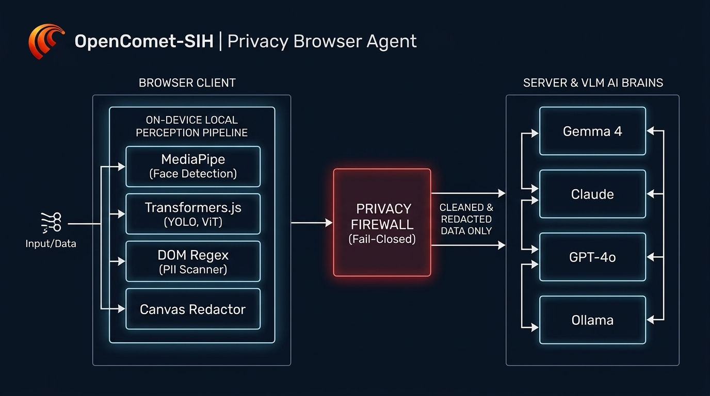
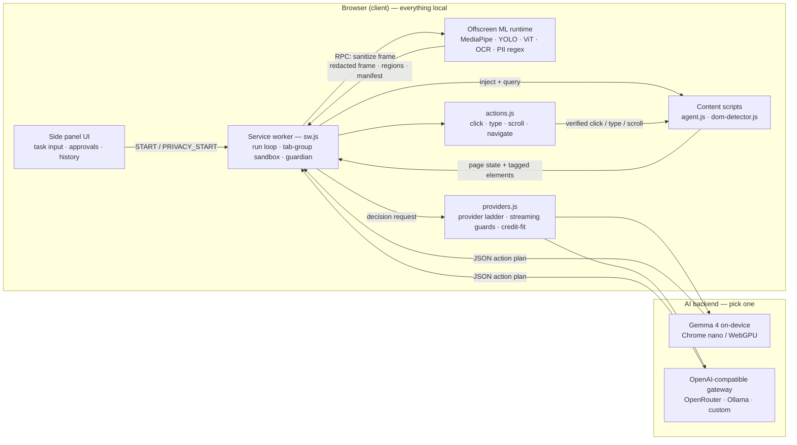
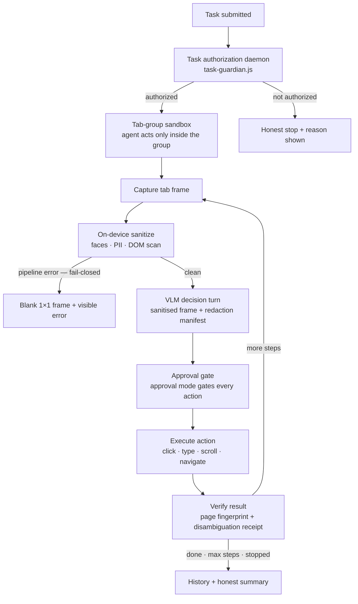
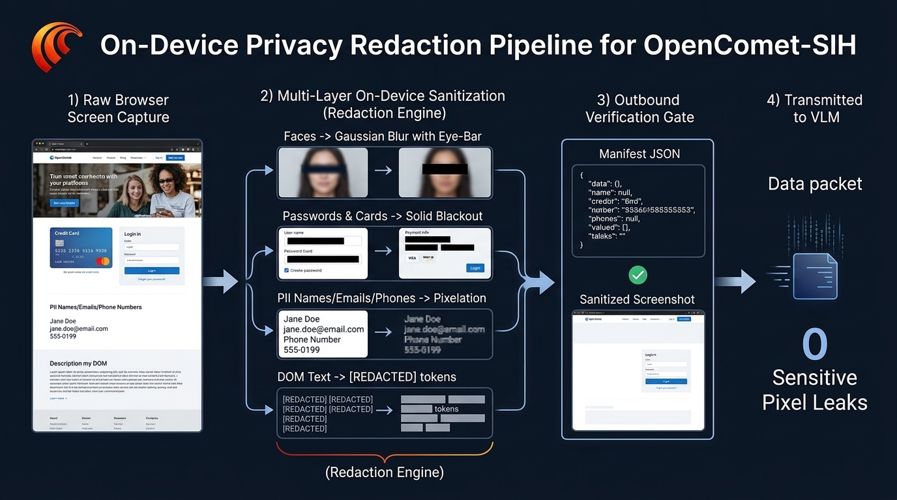
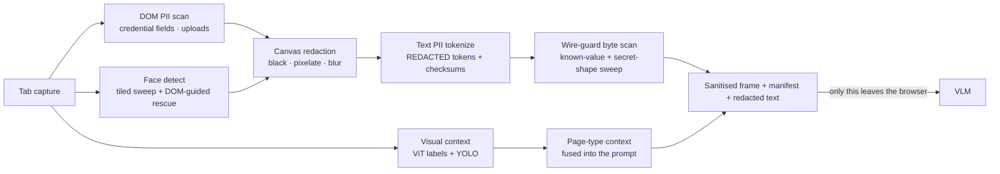

<div align="center">


# OpenComet-SIH

**A privacy-preserving vision agent for browsers — the screen the AI sees is never the screen you keep.**

*Smart India Hackathon PS #26171 — On-device Visual Perception for Light-weight Browser Agents*
*Organisation: Indian Space Research Organisation (ISRO), Department of Space*


<br>

**Tech stack**


</div>

---

OpenComet-SIH turns a Chrome MV3 side-panel agent into a **privacy-preserving
vision agent**: a local face detector + YOLO + ViT + PII scanner run entirely
in the browser (Transformers.js + MediaPipe on WebGPU/WASM, Tesseract for
pixels-only text). Sensitive content is redacted **on-device, before any
network request is made** — only the sanitised screenshot, sanitised DOM text
and a redaction manifest ever leave the browser. Since v1.5.0 the on-device
brain is **Gemma 4** (native tool calling, screenshot understanding, live
streaming) with page-RAG and semantic history search; cloud brains
(GPT-4o / Claude / Gemini / OpenRouter free models) and fully-offline Ollama
are equally first-class.

<p align="center">
  
</p>

**Interactive architecture diagram** (Mermaid — rendered natively on GitHub):



**How a task runs** — every pass through the loop is sanitized, authorized and
verified:



---

## Highlights

- **Fail-closed privacy firewall** — every network-bound screen context passes one
  boundary (`privacy-firewall.js`); if the pipeline throws, the agent sends a blank
  1×1 frame, never raw pixels.
- **Three-layer redaction** — MediaPipe faces (tiled sweep + DOM-guided rescue) →
  canvas redaction of credential fields (black / pixelate / blur) → text PII tokens
  (`[REDACTED:type]`) with checksum validation (Luhn, Verhoeff, mod-97).
- **Indian ID families** — Aadhaar (+VID), PAN (incl. mid-entry), Voter ID, passport,
  DL, IFSC, UPI VPA, GSTIN, bank account — pattern + context-gated.
- **On-device brains** — Gemma 4 (MoE multimodal) as the default agent brain, fully
  client-side; model catalog with checkpoint-resume downloads.
- **Honest autonomy** — every click is verified against a page fingerprint; every
  task runs inside a visible tab-group sandbox; approval mode gates every action.
- **Measured, never fabricated** — OpenCometBench: unit + adversarial + browser +
  mock/real-VLM E2E tiers; every number in this repo traces to a results JSON.

## Quick start

**1 · Load the extension** — `chrome://extensions` → Developer mode → **Load unpacked**
→ select `OpenCometAI-SIH/`. Pin the icon, open the side panel.

**2 · Pick a brain** — everything works out of the box in three configurations:

```bash
# (a) On-device, zero server:      Settings → AI & Models → Local → download Gemma 4 E2B
# (b) Cloud, BYO key:              Settings → provider + key (OpenAI / Claude / Gemini / OpenRouter free tier)
# (c) Companion server, offline:   cd server && OLLAMA_BASE_URL=http://localhost:11434 npm start
```

**3 · See privacy work instantly** — open `docs/assets/demo-page.html`, click
**Test capture + redact**: passwords go solid black, free-form PII pixelates,
faces blur. The preview shows exactly what would leave the browser.

**4 · Run a task** — Privacy Mode is ON by default. Type
*"Find the cheapest flight from Bengaluru to Delhi next Friday"* and hit Send.

## How the privacy contract works

| Layer | Tool | Catches | Latency |
|---|---|---|---:|
| Pixel | MediaPipe FaceDetector (tiled + DOM-crop sweeps) | faces → blur + eye-bar | 15–40 ms |
| Pixel | Canvas redactor | password / card / OTP fields → black | 3–8 ms |
| Text | Regex + checksums + optional BERT NER | emails, phones, Aadhaar, PAN, SSN, IBAN, API keys… | 2–5 ms |
| Pixel | Canvas pixelate | free-form PII text → pixelated | 3–8 ms |

Every redacted region ships in a JSON **manifest** next to the sanitised image, so
the VLM knows *what it cannot see and why*. DOM text is tokenised
(`[REDACTED:email]`) before transmission. **Fail-closed:** pipeline error ⇒ blank
1×1 PNG + visible error — sending raw pixels is never the failure mode. Deep dive:
[`docs/architecture/PRIVACY_VISION.md`](docs/architecture/PRIVACY_VISION.md).

<p align="center">
  
</p>

**Interactive privacy-pipeline diagram** — what happens between a raw frame and
the network:



Per-stage diagrams (PII taxonomy, face-recall cascade, coordinate spaces) live
in [`docs/architecture/PRIVACY_VISION.md`](docs/architecture/PRIVACY_VISION.md).

## Measured results (OpenCometBench)

```bash
node OpenCometBench/run-all.js                    # all Node suites, exit 0 = targets met
node OpenCometBench/run-opencomet-bench.mjs --all # + E2E (real extension) + adversarial tiers
node OpenCometBench/e2e/run-e2e-real.mjs --warmup # real-VLM tier, steady-state (BYO key via env)
```

| Metric | Measured | Source |
|---|---|---|
| PII precision / recall | **1.00 / 1.00** (366+ corpus, checksum-validated; synthetic corpus built from the detector's own checksum/label rules) | `privacy.bench.js` |
| Redaction coverage / mean IoU | **1.000 / 0.987**, pixel leakage 0/340, over-redaction 0% (real-browser pixel tier) — unit harness on the same build: 0.983 / 0.938 / 5.9% over-redaction | `browser/harness.mjs` (browser report) · `redaction.bench.js` |
| Visual context accuracy | **12/12** DOM-fused, **12/12** ViT-fused (browser tier; unit harness: 11/11) | `browser/harness.mjs` (browser report) · `visual-context.bench.js` |
| Security / fuzz / server-validation | 29/29 · 0 leaks in 216 · 25/25 | `security/fuzz/server-validation` |
| Sanitize P50 **warm** (unchanged screen) | **1216 ms** (memo hit; OCR memo collapses the OCR leg; n=7) | browser report |
| Changed frame (memo miss, full re-detect) | 12885 ms (YOLO 7841 + OCR 3402) — by design, scene-change-attack verified | browser report |
| Real-VLM step (OpenRouter free model) | VLM 4679 ms · action 777 ms · **0 privacy blocks** · verified 1/1 (single-step reference run) | `e2e-real` report |
| Cold first step (one-time model load) | ViT load 37873 ms — a session warm-up (`--warmup`) collapses subsequent turns; a committed warm-up results artifact is still pending | `e2e-real` + warm-up probe |

**Honesty rule:** cold-start, warm-unchanged-screen and changed-frame numbers are
different conditions and are never merged. OCR geometric coverage is honestly
0.75 (4/4 pixel regions altered, zero observed leakage — fail-closed verified).
Import any report JSON into Settings → Privacy & Vision → **SIH Scorecard**, or
drag it onto `OpenCometBench/dashboard.html`. Full methodology:
[`OpenCometBench/README.md`](OpenCometBench/README.md).

## SIH evaluation mapping

| Criterion (weight) | Approach |
|---|---:|
| Visual context accuracy (25%) | Page classifier + ViT scene labels, adaptive gate, fused into every decision |
| Sensitive/PII detection P+R (20%) | 4-layer detector: tiled faces, DOM semantics, regex+checksums, contextual risk |
| Redaction precision (20%) | Per-type styles, safe manifest (no raw selectors leave), fail-closed |
| Client resource use (20%) | INT8 models, WebGPU-first/WASM fallback, lazy-load, ~50–150 MB RAM, heap Δ0 in browser run |
| E2E latency (15%) | Memoized re-hits, session warm-up, speed profiles, shot-reuse on unchanged screens |

## What's new in v1.29.0

- **Upgraded dom-detector** — interactive-element detection with visual tagging:
  every clickable control is boxed on-screen with a numeric badge, and the
  element list carries the same number as its identity — one identity per
  control across screenshot, prompt and click. Cursor-first interactivity,
  shadow DOM + same-origin iframes, top-element guard, registry/xpath
  relocation. How it works:
  [`docs/guides/DOM_DETECTOR.md`](docs/guides/DOM_DETECTOR.md).
- **Streaming failure ladder** — 45 s idle watchdog, 150 s attempt / 300 s total
  caps, budget ×2 → thinking-off → non-stream fallback, plus a **402
  credit-fit refit** that rescales `max_tokens` to what the gateway balance can
  afford instead of killing the run.
- **Diagnostics guide rebuilt** — line anatomy, `VLM-REQ / VLM-RAW / VLM-RES`
  groups, failure kinds with interactive diagrams, export how-to.

Earlier rounds — Firefox support from one source tree (v1.17.0), the
Task Authorization Daemon (v1.18.0), disambiguation of repeated controls
(v1.19.0) — are summarised in
**[`docs/changelog/`](docs/changelog/INDEX.md)**, one file per version.

## Documentation

| Folder | Contents |
|---|---|
| [`docs/changelog/`](docs/changelog/INDEX.md) | Release notes v1.14 → v1.29.0, one file per version |
| [`docs/guides/`](docs/guides/GETTING_STARTED.md) | Getting started, features, demo script, developer guide, FAQ, Gemma 4, diagnostics, DOM detector |
| [`docs/sih/`](docs/sih/SIH_READINESS.md) | SIH readiness per version, claim-by-claim novelty, gap analysis, distribution |
| [`docs/architecture/`](docs/architecture/PRIVACY_VISION.md) | Privacy architecture deep-dive + file-by-file guide |
| [`docs/research/`](docs/research/vlm-speed-research.md) | Measured VLM latency research behind the speed profiles |
| [`OpenCometBench/`](OpenCometBench/README.md) | The benchmark: harnesses, fixtures, results, dashboard |

Full docs index: **[`docs/README.md`](docs/README.md)**

## Known limitations

- Firefox stable has no WebGPU → pipeline falls back to WASM (~2× slower, still real-time).
- BERT NER (~110 MB) is opt-in; the regex pass covers most tasks.
- Cross-origin iframe DOM text is not scannable (browser security) — faces inside
  iframes are still blurred at the pixel level.
- Changed-frame re-detection cost is deliberate (privacy semantics); region-of-interest
  re-detection is future work.

## Credits & license

Built on [OpenCometAI](https://github.com/) (MIT). Libraries: Transformers.js
(Apache-2.0), MediaPipe Tasks-Vision (Apache-2.0), ONNX Runtime Web (MIT),
Tesseract.js (Apache-2.0), OpenAI/Anthropic/Gemini/Ollama SDKs. Model weights:
Gemma 4, Granite 4.0, LFM2-VL, all-MiniLM — per their model cards (see
[`LEGAL.md`](LEGAL.md)). Code: MIT — see [`LICENSE`](LICENSE).

*Diagnostics: every context (service worker · offscreen ML runtime · sidepanel)
logs through one unified system — see
[`docs/guides/DIAGNOSTICS_LOGGING.md`](docs/guides/DIAGNOSTICS_LOGGING.md).*
