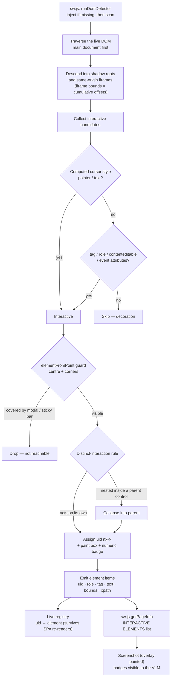
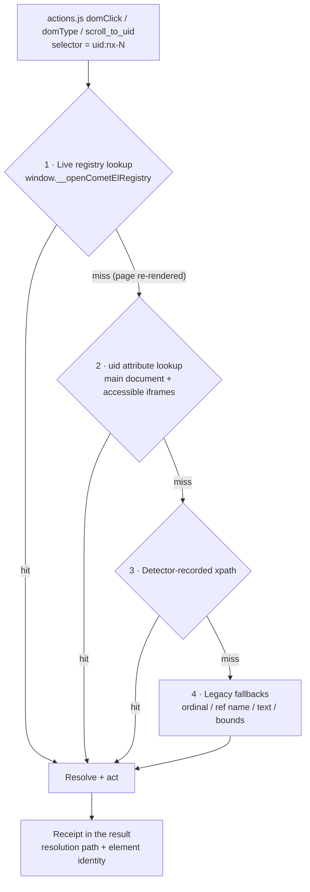

# The Upgraded DOM Detector — Element Tagging & Relocation

*How OpenComet finds every interactive control on a page, paints it with a
box + numeric badge, and clicks the exact element the model chose.*

---

## 1. What it does

The upgraded dom-detector (`src/content/dom-detector.js`) replaces the old
tag-selector element scan with a full-page traversal that identifies
**interactive elements** the way a user perceives them — anything that
responds to a cursor, a tap, or keyboard focus — and paints every one of them
on-screen with a **box and a numeric badge**.

The number is the contract:

- The **screenshot** shows badge `15` next to a button.
- The **INTERACTIVE ELEMENTS list** in the prompt contains the same control as
  `uid:nx-15`.
- The model answers `{"selector": "uid:nx-15"}` — and the executor relocates
  that exact element, not a look-alike.

One identity per control across screenshot, prompt and click. No coordinate
guessing, no "the third blue button".

## 2. Detection pipeline

Three design decisions carry most of the win:

- **Cursor-first interactivity.** The computed `cursor` style is the strongest
  single signal, checked before tag/role/contenteditable/event-attribute
  heuristics. Custom widgets — YouTube player controls, Gmail chips, cards
  built as plain `
`s — register even though they are not native controls.
- **Top-element guard.** `elementFromPoint` at the centre and corners drops
  controls buried under modal backdrops, sticky headers and cookie bars. ARIA
  menu containers stay exempt because their options legitimately render over
  other content.
- **Distinct-interaction rule.** Nested interactives collapse into their parent
  unless they act on their own — one badge per real control, no duplicate
  clutter around composite widgets.

## 3. From badge to click — relocation

The detector does not just label elements; it gives the executor several
independent ways to get back to the same element later (pages re-render between
the scan and the click — SPA updates, countdown timers, infinite scroll):

The registry is the strongest link: because the detector keeps a live
`Map` of uid → element, relocation survives SPA re-renders and reaches inside
shadow roots and iframes that `querySelector` cannot cross. Xpath is the
deterministic fallback; the legacy text/ordinal/bounds matching remains as the
final safety net, so nothing the old scan could click becomes unclickable.

## 4. What the model sees

The page state handed to the VLM fuses three views of the same page:

| View | Source | Carries |
|---|---|---|
| Screenshot | `chrome.tabs.captureVisibleTab` with the badge overlay painted | Boxes + numeric badges on every control |
| INTERACTIVE ELEMENTS list | `dom-detector.js` items via `sw.js getPageInfo` | `uid:nx-N`, role, text, bounds, xpath |
| Legacy page text | Inline scan (unchanged) | Headings, tables, form labels — always from the legacy path |

The prompt rules make the mapping explicit (see `src/lib/prompts.js`):
*screenshot badge "15" maps to selector `uid:nx-15`*, and the model is told to
prefer `uid:` selectors, falling back to `text:` or CSS only when the list has
no match.

## 5. Element item fields

Each detected element is emitted as a plain item so prompts, overlay,
disambiguation and executors stay compatible:

| Field | Meaning |
|---|---|
| `uid` | Stable id `nx-N`; badge number = uid without the `nx-` prefix; also stamped as a DOM attribute |
| `role` / `tag` | Accessibility role or tag name (`button`, `link`, `textbox`, …) |
| `text` | Visible label (truncated) |
| `bounds` | Page-space rectangle — iframe items arrive pre-translated via cumulative offsets |
| `xpath` | Detector-recorded path, the deterministic relocation key |
| `editable` / `href` | Type hints that route items into the inputs / links prompt groups |

Cross-origin frames are out of scope: they carry an error marker and are
skipped — pixel-level privacy scanning still covers their contents.

## 6. Where it hooks in

- `sw.js` — `runDomDetector()` (inject-if-missing + scan), detector-first
  `getPageInfo` with the legacy inline scan as fallback, screenshot overlay
  coordination.
- `src/background/actions.js` — `domClick` / `domType` / `scroll_to_uid`
  relocation chain (§3) plus disambiguation receipts.
- `src/content/dom-detector.js` — detection, painting, registry.
- `src/lib/prompts.js` — the badge ↔ uid contract rules.
